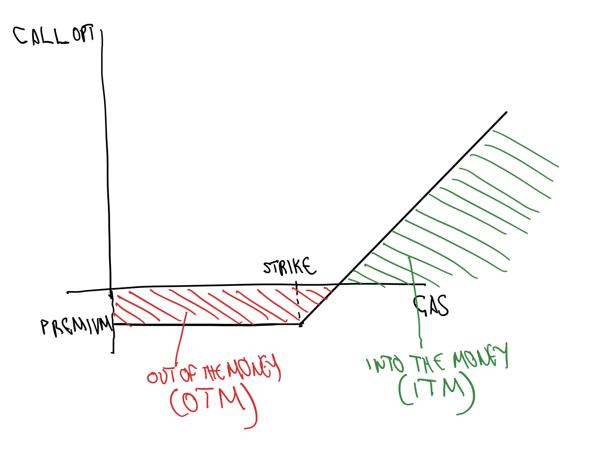
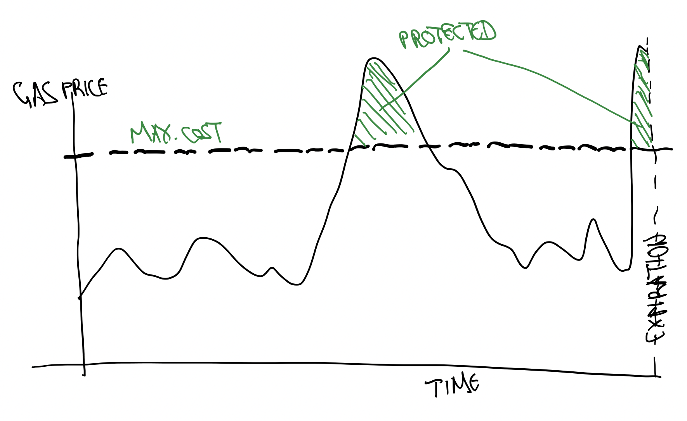

[This project, (PetroETH Option DEX)](https://ethglobal.com/showcase/petroeth-option-dex-vo05p) won the following prizes at the [ETHGlobal Bangkok 2024](https://ethglobal.com/events/bangkok) hackathon:

🥇 [Rome Protocol - Best Use of Rome Protocol 1st place](https://ethglobal.com/showcase/petroeth-option-dex-vo05p)

🏆 [Nethermind - Build an Opinionated DEX](https://ethglobal.com/showcase/petroeth-option-dex-vo05p)

🥈 [Uniswap Foundation - Unichain 2nd place](https://ethglobal.com/showcase/petroeth-option-dex-vo05p)

🏆 [Linea - Best Project Deployed on Linea and MetaMask JSON-RPC API](https://ethglobal.com/showcase/petroeth-option-dex-vo05p)

# gas-opt-dex
EVM Gas Options Decentralized Exchange

The demo video and deployment addresses can be found [here](./demo/README.md).

## Abstract

This is an Ethereum Gas Options Decentralized Exchange (DEX). Web3 applications can purchase Call options on the EVM Gas price in order to hedge the price of the Gas
and provide smoother operation to the users. Any user can do the same, permissionlessly.
Market makers / underwriters can offer these options. Anyone writing an option needs a collateral and can be liquidated permissionlessly by anyone.

## Introduction

We would wonder why EVM Gas price still matters in 2024. Looking into it, actually now it matters just as ever before. Gas intensive protocols have been deployed on Layer 1 (L1) and L2 EVM blockchains. Zero Knowledge verifiers called more frequently than ever consume a lot if gas (1M is not unusual). Fully Homomorphic Encryption (FHE) capable blockchains provide encrypted operations at very high prices, and as more applications are deployed on them, this demand increases.

Gas prices can be unpredictable and cause slowdowns and poor user experience. Users may even start avoiding high Gas consuming applications. To mitigate this problem,
the protocols and web3 applications can subsidize the Gas by sending refunds to the users in form of Native Currency (for example ETH on the Ethereum network). Since
Gas is automatically purchased using Native Currency, the user would have an illusion that the Gas cost is low.

The Web3 applications and protocols do not always have to subsidize the Gas, but only when its price spikes. In order to avoid large losses, such application could purchase
Gas Call options, usually out-of-the-money and secure stable pricing. If the price spikes, the Option would cover the cost, and otherwise a small cost for the Option Premium 
would justify the pleasant user experience.

On the other hand, the Option Writers would profit through their ability to better predict the Gas pricing, speculate on it and make profit from the Premiums on the OPtions sold.

The Option Writers have to keep excess collateral in order to satisfy payout of the options at Exercise. If they become undercollateralized, they can be liquidated by any
Liquidator permissionlessly. The liquidation imposes a penalty paid by the holder of the undercollateralized position, in favor of the liquidator.

### Why Options?

There are Gas tokens priced at the value of Gas already, such as CHI and GST2. However, purchasing Gas at Spot price can get expensive for the web3 application. In addition, the application has to worry about purchasing the tokens at the right time and then have locked funds in such tokens.

Call Options are more natural for the described use case. The web3 applications / protocols would usually purchase out-of-the-money Gas Call Options and use them as insurance policy. The Options would become valuable only when the Gas price spikes above the Strike Price of the Option:


### American Style Option

Our protocol provides American Style Options, which are ones that can be Exercised at any time, with intention to do so when the Gas price spikes. European Style Options would impose risk to the holder, as the Gas price may spike and retreat before the Expiration of the Option, and as such compensate no value to the holder:


American Style Options are more difficult to manage for the Market Makers / Writers, but in our use case, this is almost a must.

## Implementation

The smart contracts are written in Solidity. The protocol needs a price oracle for the EVM Gas price in order to enforce collateralization. We are only interested in the Base Fee and not the "tip" as that is discretionary to the user to speed up their transaction. Luckily the EVM already provides this oracle using ```block.basefee```.

The DEX is implemented as Order Book, as we are worried that the erratic price of EVM Gas is not suitable for AMM formulas.

Liquidation is performed if the Option Writer falls below a constant (currently 3 times) amount of collateralization.

Option Exercise can be performed at any time at the current price, unless the Option expires in which case the oracle price is used to settle. Calls to Exercise result in immediate payout to the caller, so the workflow is just to put a conditional Exercise ahead of Gas-demanding calls.

## No Front End - Maybe Never

This Protocol has three kinds of participants and none of them would use a GUI:
- Option Buyers (web3 DApps, protocols), which hedge,
- Option Writers (Market Makers / Underwriters), which speculate,
- Option Liquidators, which generate revenue keeping the Option Writers honest

In addition, anyone, usually the above three kinds of users can create a new Options Contract permissionlessly at any time.

## Further work

- Dashboard
- Perpetual Options and Funding Rates
- Market Making bots
- Liquidation bots
- LP Vaults